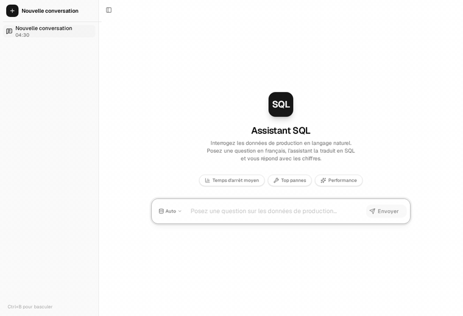

# SQL Assistant — Text-to-SQL pour données de production & maintenance


Assistant qui permet de **communiquer avec des données tabulaires en langage
naturel**. Vous posez une question en français, il la traduit en SQL, l'exécute
sur une base DuckDB et répond avec les chiffres, la source et un insight.

Cas d'étude : données de production et maintenance industrielle (OPC Group,
Maroc, phosphates). Les données sont **fictives** (jeu de démonstration).

## Démo



*Pose d'une question en français → génération du SQL → exécution sur DuckDB →
réponse chiffrée avec source et insight, en streaming temps réel.*

## Pourquoi Text-to-SQL + DuckDB ?

Le postulat de départ : **communiquer avec des données tabulaires en langage
naturel**. Deux choix structurants :

- **Text-to-SQL, pas vector RAG** — les données sont structurées (production,
  maintenance, temps d'arrêt). Pas de documents à indexer. Un schéma + un LLM =
  requête SQL exacte et traçable.
- **DuckDB comme moteur** — excellent moteur OLAP embarqué. Lecture seule, zéro
  serveur, zéro latence réseau, schéma fixe. Parfait pour de l'analyse sur des
  données extraites périodiquement.

## Stack

| Couche | Technologie |
|---|---|
| Backend | LangGraph 1.2 + DeepSeek V4 Flash (OpenRouter) + DuckDB |
| Frontend | Vite 8 + React 19 + shadcn/ui + Tailwind v4 |
| Streaming | `@langchain/react` — `useStream` hook |
| Agent | `create_agent()` (model → tools → model) + `trim_memory` middleware |

## Structure

```
├── backend/           ← Agent LangGraph + DuckDB
│   ├── src/agent.py   # Agent principal + title generator
│   ├── langgraph.json # Déclaration des graphs
│   └── ocp_schema.md  # Schéma de la base (injecté dans le prompt)
├── frontend/          ← Interface React
│   └── src/
│       ├── Chat.tsx          # Composant chat + streaming
│       ├── App.tsx           # Orchestrateur
│       └── hooks/            # Gestion conversations localStorage
```

## Lancement

```bash
# Backend
cd backend
source .venv/bin/activate
langgraph dev --host 0.0.0.0 --port 2024

# Frontend (autre terminal)
cd frontend
npm run dev
```

## Pipelines de l'agent

- **Agent principal** (`agent`) — `create_agent()` avec l'outil `query_db(sql)`
  qui exécute du SQL DuckDB et retourne un DataFrame en texte. System prompt en
  français avec le schéma injecté, `trim_memory` garde les 10 derniers messages.
- **Génération de titre** (`title-generator`) — agent sans tools, un seul appel
  modèle, produit un titre de 3-6 mots en français après le premier message.

## Règles métier (agent)

- Langue : questions et réponses en **français**
- SQL : **DuckDB, SELECT uniquement**, jamais de DML
- Format : question → SQL (bloc code) → chiffres → source → insight
- Précision : valeurs exactes avec unités, pas de "environ"
- Limite : 10 résultats sauf demande explicite

## Détails d'architecture

Voir `backend/ocp_schema.md` pour le schéma de la base.

## Roadmap

État d'avancement et prochaines étapes.

- [x] Agent LangGraph avec outil `query_db` + `trim_memory`
- [x] Génération de titres de conversation (agent dédié)
- [x] Frontend React + streaming temps réel (`useStream`)
- [x] Persistance des conversations (localStorage)
- [ ] Tests unitaires (génération SQL, refus DML, cas limites)
- [ ] Docker Compose (`docker compose up` = tout tourne)
- [ ] Jeu de données plus gros (10k+ lignes)
- [ ] Schema linking (embedding → tables pertinentes)
- [ ] Validation EXPLAIN avant exécution
- [ ] Cache sémantique + few-shot dynamique
- [ ] Gestion d'erreurs robuste (timeout, retry, fallback model)
- [ ] Persistance des threads via PostgreSQL (`langgraph up`)

